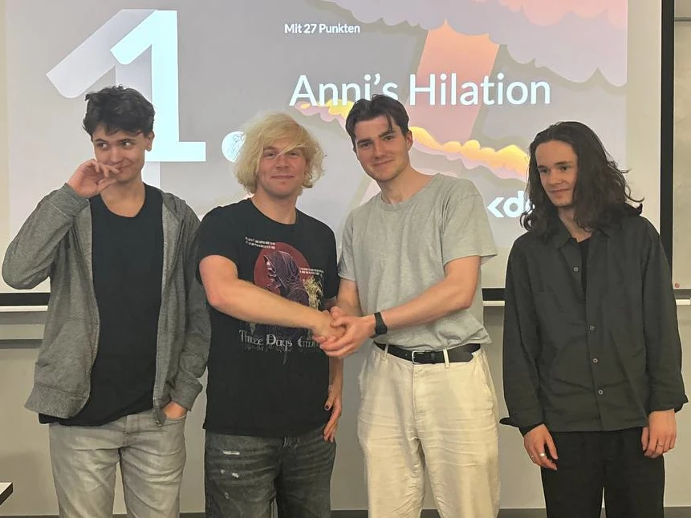

Our exhilarating couch co-op game "Anni's Hilation" won the 18th HPI GameJam! Over the course of 36 hours we developed the game in Godot as a submission for the jam's theme "Architects of Annihilation". Play it right now on [itch.io](https://saraqael-m.itch.io/annis-hilation)!

> Mad professor Anni has crafted herself a friendly humanoid companion out of spare body parts she found in the local graveyard. The creature, going by the name of Hilation, now has to protect it's maker from evil spirits that have been awoken by the unholy experiment. Steer Hilation to fend off the foes, but be careful - it's body is not holding together all too well. Whenever an arm or a leg falls off, rush in with Anni to patch the monster back together before the both of you get circled by the undead!

### Controls

Anni:

- ARROWKEYS to move
- SHIFT to dash

Hilation:
- W/A/S/D to move
- Q to strike with left arm
- E to strike with right arm

Or, when playing with gamepads, select the players in the starting screen. Then, move using the left stick and dash / strike using the shoulder buttons.

### Download

[Get it here for Windows or Linux](https://saraqael-m.itch.io/annis-hilation)

### The GameJam

The HPI GameJam is held bianually at my university's computer science faculty, the Hasso Plattner Institute. This semester, I participated in a team of 4. In the final rating, we secured the top prize out of all submissions! Check out the other games [here](https://itch.io/jam/hpi-gamedev-klub-jam-18).

