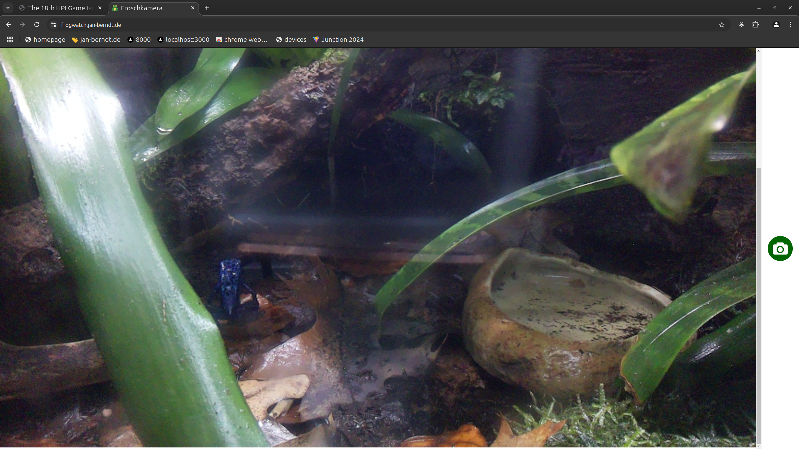

+++
title = 'Building a Frogwatching Camera'
date = 2024-01-12
+++

Since I moved out from home, my parents have replaced me with a total of 4 poison dart frogs. Standing in my old room is a huge glass box housing the amphibians. As a christmas present, I set up an old Raspberry Pi with a camera livestreaming the frogs' every move. Want to see what they are up to *right now*? Take a look at [frogwatch.jan-berndt.de](https://frogwatch.jan-berndt.de)!

Using `supervisorctl`, the Pi is continually running a python script to capture and send JPG images to my Python Websocket server. The frontend itself is hosted seperately as a static HTML/JS page. Check out the [Github Repo](https://github.com/jafber/frogwatch) if you'd like to know more.
