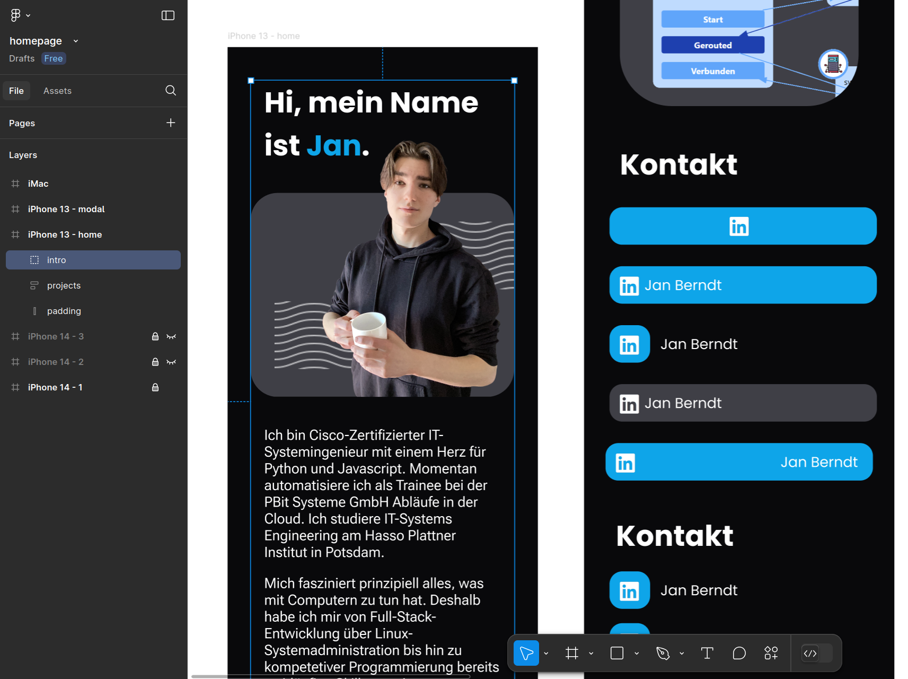

Edit March 2025: I've fully switched to my blog here and stopped maintaining this homepage. However, I'm keeping it up to showcase some frontend skills.

[homepage.jan-berndt.de](https://homepage.jan-berndt.de/en) is my new and improved homepage, and I'm pretty proud of how it turned out.

## The Code

I programmed the site and its features like the hover effects or language switcher in NextJS, a framework for creating ReactJS-based apps. The pretty part is done using TailwindCSS. In the end, the project is bundled into a static webpage. For hosting, I'm using [CimeyClust](https://cimeyclust.com/), an awesome provider led by a fellow HPI student. For more details, see the [Github repo](https://github.com/jafber/homepage).

## The Design

In this project, I learnt that while thinking through an idea and then putting it into code might work for an algorithm, it definitely does not work for a design. After some horrible-looking attempts, I switched to Figma so that I could iterate on designs faster:

Writing the actual implementation with the mockups as a guide worked much better. I also got a lot of help from the book [Refacturing Ui](https://www.refactoringui.com/) by Adam Wathan and Steve Schoger.
