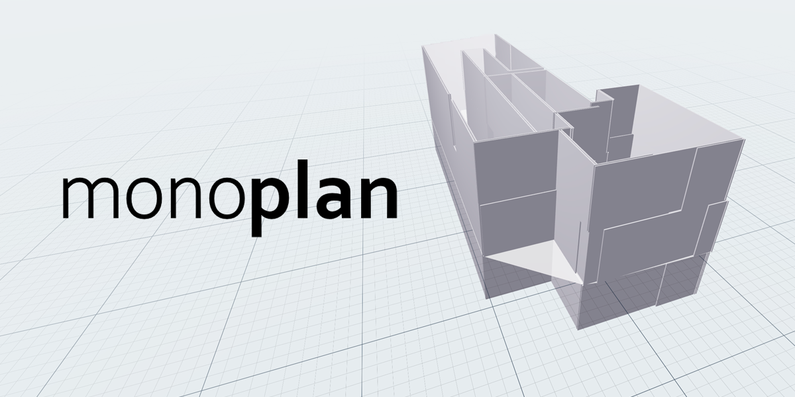
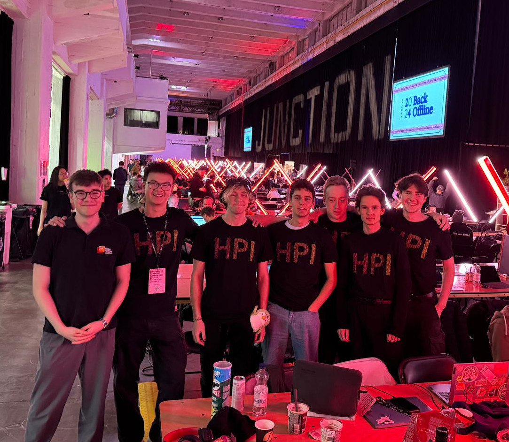

+++
title = 'The Junction 2024 Hackathon'
date = 2024-11-10
+++

This weekend I took part in [Junction](https://www.hackjunction.com/), one of the largest hackathons in Europe! Over the course of the weekend, we developed MonoPlan, a software to intelligently create 3D building models from technical drawings. Check out the web app at [monoplan.jan-berndt.de](https://monoplan.jan-berndt.de/)!

Together with friends from Uni, I flew out to Helsinki to compete. Thanks to the HPI for the cool T-Shirts!

Our team developed MonoPlan as a submission to the "BIM for everyone" Challenge sponsored by KONE, a large producer of elevators. We also created this pitch video:



We wrote the frontend in ReactJS using Three.JS to render the buildings and Vite for building the page. The backend is a simple Python/Flask server. If you're interested in the nitty gritty details, the [Github Repo](https://github.com/DanielC04/Junction2024) is public. Just don't look too closely at the spaghetti code.

