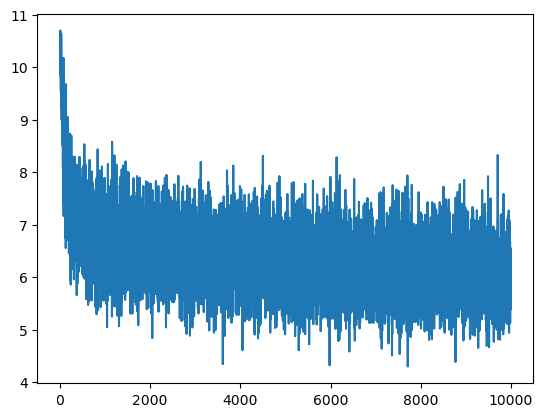
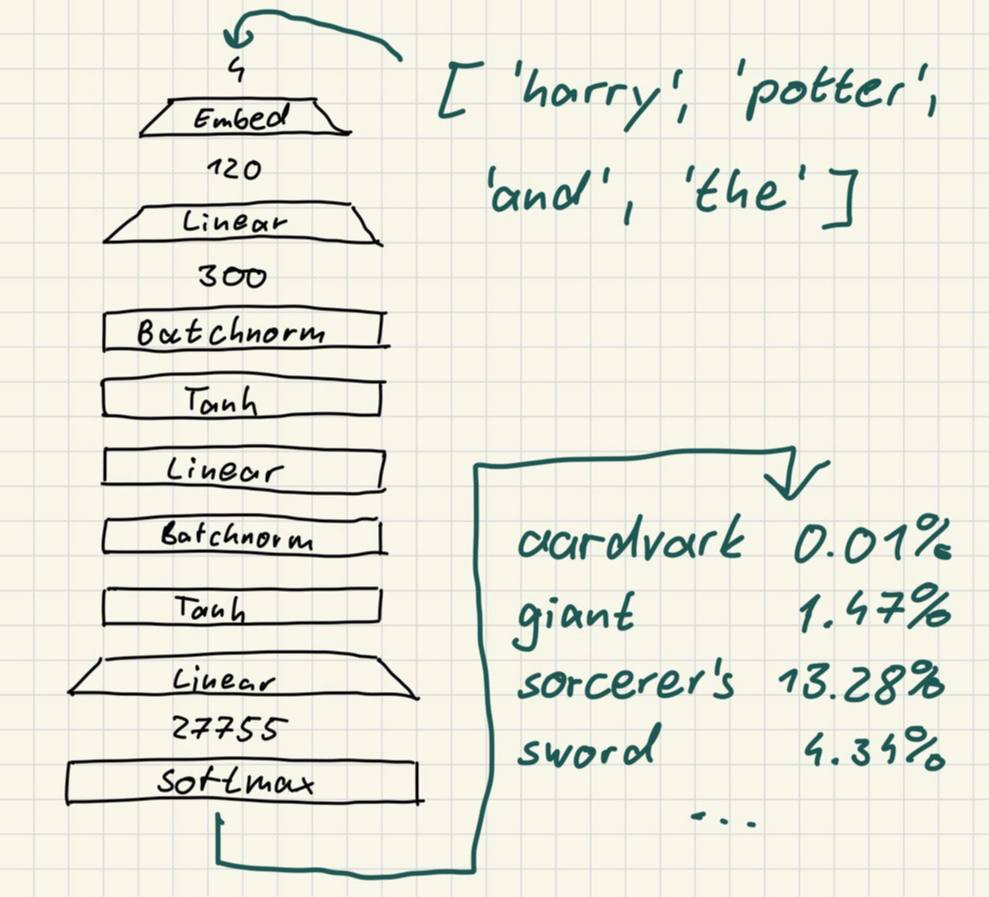
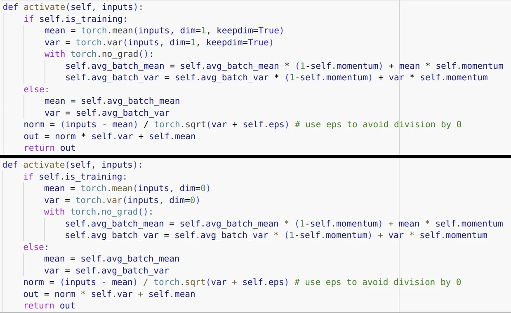
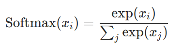

This week I continued on my quest of fully implementing Andrej Karpathy's course "Neural Networks - Zero to Hero" in python. Right now, I'm working on the tool "makemore", which is a simple AI that can train on natural language datasets to generate texts that sound similar to the training data. Stay tuned for the best quotes at the end of the post!

## Writing a new Harry Potter novel

Before getting into the gritty details, let me show you what it can do so far. For demonstration purposes, I want the model to write texts trained on the Harry Potter novels. Since I won't support criminal organizations like libgen, which was recently sentenced to a [30 million dollar fine](
https://tarnkappe.info/artikel/rechtssachen/libgen-vor-gericht-30-millionen-dollar-strafe-fuer-schattenbibliothek-301961.html)
I bought all 7 books right from the publisher. After an afternoon of typing down their contents onto my laptop, I was left with a text file of 1.153.633 words.

I followed the the paper by [Bengio et al.](https://www.jmlr.org/papers/volume3/bengio03a/bengio03a.pdf) to find some sensible default parameters for my network. Let's see how it completes the phrase `harry potter and the` untrained.

```
harry potter and the ideathis better spraying halfmoaning shave pelt bangin scores
harry potter and the higher beadyeyed dealin bed rulebreaker headboard redder swooped
harry potter and the fat luciuss delightful allforthebest entrancing feared windermere mehr
```

Expectedly nonsensical. After 10.000 training iterations, we get the following:

```
harry potter and the violent neville . when she was sitting ginny facing if ron interferin soared and lee
harry potter and the diadem would high she get too he was looking on the floor and then seventeenyearold
harry potter and the beauties of her creatures the diddydums into his face creature onto protected to up the
```

I know, these don't make a terrible lot of sense either. But we can clearly see the network understanding key language concepts like

- an object following after article "the",
- common phrases, like "into his face" and
- the usage of periods after sentences.

The loss curve confirms we did improve, if slowly:



## So how does it work?

I am using a multi-layer perceptron (MLP). You can find my code [on github](https://github.com/jafber/neuralnets). An MLP is a sequence of layers that feed into each other. If I input data into the top layer, every following layer will do some mathematical operation on the data, transforming it until we receive some (hopefully) meaningful output at the bottom. My MLP looks like this:

Let me explain. I feed in a vector of 4 words (e.g. "harry potter and the") and receive a vector of 27.755 probabilites. Each probability value is assigned to one word from the english language, telling us how likely it is to follow the previous 4 words. For example, since `probabilities[0] = 0.01%` tells us that "harry potter and the aardvark" is not a very likely combination of words.

To acheive this, I use quite a few layers:



Let me quickly explain what they do.

### Embedding

Assigns a vector of 30 decimal numbers to each word. Words that are semantically similar will have similar embeddings as well.

### Linear

The "neural" part of the neural network. Comprises 300 neurons which get activated by the inputs multiplied by some weight.

### Batchnorm

Standardizes the inputs into a distribution of standard deviation 1 and expected value 0, shifted by some constant parameters. This really messed me up for a while because I had the dimensions switched around in my code at first.



Can you spot the difference :microscope::raised_eyebrow:?

### Tanh

A cool sigmoid function to clamp activation values between -1.0 and 1.0.

### Softmax

This allows us to turn a bunch of numbers, where higher numbers mean the corresponding word is more likely to follow, into an actual probability distribution.



Apparrently our maths professor did not lie when he said log-likelihoods were important for AI.

## Quotes

The net came up with some real gems, such as the smacked lord:

```
dumbledore looked at harry and saw her smacked lord where there was incantatem snapping been favorite as he used her
```

He used whom :flushed:?

Of course, we had the usual: Harry Potter and the tip.

```
harry potter and the tip . yeah the usual . it had said ron cheerfully it filthiest why .
```

And at last, after destroying all the horocruxes, Harry managed to finally put the sword back into the egg.

```
harry potter and the sword all back into the egg .
```


I'll continue following along the lecture series. I'm already about half of the way there to the biblical [4 hour GPT-2 full guide](https://youtu.be/l8pRSuU81PU?si=TYLrSzwRvQFBV6GH), so stay tuned.