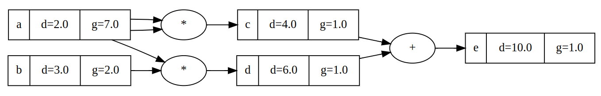

So I dunno if you've heard about it, but this new "artificial intelligence" thing sounds like quite the big deal. I'm told some systems are even powerful enough to play chess now.

All jokes aside, I want to gain a deeper understanding of machine learning. This is not only because it's fascinating from a technical perspective, but also because the [risks posed by AI](https://www.safe.ai/ai-risk) are getting uncomfortably real. And I'm guessing, the first step I can take to someday prevent a AI from causing damage is learning how it works.

I'm following OpenAI Co-founder Andrej Karpathy's [Neural Networks: Zero to Hero](https://karpathy.ai/zero-to-hero.html) lecture series and recreating some of his examples in code. Over the past two weeks or so I've reimplemented his [micrograd](https://github.com/karpathy/micrograd) grading engine and learned a lot about neural networks in the process. Check out my full demo on [github](https://github.com/jafber/neuralnets/blob/main/jangrad/jangrad.ipynb).

## The Grading Engine

My grading engine jangrad™ allows its users to backtrack operations on values. For example, we can calculate:

```python
a = Value(2.0)
b = Value(3.0)
c = a * a
d = a * b
e = c + d
e.backtrack()
```

giving us a tree of the operations that we did to get to `e`. Most importantly we can compute the gradients of its components. In our example, `da/dd = 7` and `db/dd = 2`:



I've implemented addition, subtraction, multiplication and some rectifier functions. I also partially coded powers but quickly noticed that deriving exponents can give you imaginary numbers?


So we're not doing that.

## Training Neural Networks

I use the grader to build a multi-layer perceptron out of neurons. Each neuron takes some inputs, multiplies them by weights, applies the rectified linear unit function and passes the result on to the next layer of neurons.

Using this, we can learn a simple dataset like:

```
[2.0, 3.0, -1.0]    -> 1.0
[3.0, -1.0, 0.5]    -> -1.0
[0.5, 1.0, 1.0]     -> -1.0
[1.0, 1.0, -1.0]    -> 1.0
```

So let's look at how my network can replicate this function with less and less error:


Whoops, that doesn't look good. Let's try a slower learning rate.


Much better. After 1000 iterations, my network has successfully learned the dataset. Just as a sanity check:

```python
net([2.0, 3.0, -1.0]),
# [1.0]
net([3.0, -1.0, 0.5])
# [-1.0]
net([0.5, 1.0, 1.0])
# [-1.0]
net([1.0, 1.0, -1.0])
# [1.0]
```

Join me next week as I build Skynet to take world control.
